# Article Diagrams - Mermaid Code

Use these Mermaid diagrams to generate images for the Substack article.

**Rendering Options:**
- [Mermaid Live Editor](https://mermaid.live) - Paste code, export PNG/SVG
- [Excalidraw](https://excalidraw.com) - Hand-drawn style
- GitHub - Renders Mermaid automatically in markdown

---

## 1. Journey Timeline

---

## 2. Curriculum Structure (Pyramid)

```mermaid
graph TB
    subgraph Year5[" "]
        Y5[🎓 YEAR 5: Thesis & Defense<br/>336 days • 2,500 hrs]
    end
    subgraph Year4[" "]
        Y4[🔬 YEAR 4: Research Phase I<br/>336 days • 2,500 hrs]
    end
    subgraph Year3[" "]
        Y3[📝 YEAR 3: Qualifying Exams<br/>336 days • 2,500 hrs]
    end
    subgraph Year2[" "]
        Y2[⚛️ YEAR 2: Advanced Quantum<br/>336 days • 2,500 hrs]
    end
    subgraph Year1[" "]
        Y1[🔮 YEAR 1: Quantum Mechanics<br/>336 days • 2,500 hrs]
    end
    subgraph Year0[" "]
        Y0[📐 YEAR 0: Math Foundations<br/>336 days • 2,500 hrs]
    end

    Y0 --> Y1 --> Y2 --> Y3 --> Y4 --> Y5

    style Y0 fill:#1a365d,color:#fff
    style Y1 fill:#2c5282,color:#fff
    style Y2 fill:#2b6cb0,color:#fff
    style Y3 fill:#3182ce,color:#fff
    style Y4 fill:#4299e1,color:#fff
    style Y5 fill:#63b3ed,color:#fff
```

---

## 3. Getting Started Flowchart

```mermaid
flowchart TD
    START([🚀 Start Here]) --> Q1{What's your<br/>math background?}

    Q1 -->|No calculus| PATH1[📚 Complete Beginner Path]
    Q1 -->|Some math/physics| PATH2[🎯 Diagnostic Exam Path]

    PATH1 --> Y0[Year 0: Day 001<br/>Single Variable Calculus]
    PATH2 --> EXAM[Take Month 12<br/>Diagnostic Exam]

    EXAM --> Q2{Score 80%+?}
    Q2 -->|Yes| Y1[Year 1: Day 337<br/>Quantum Mechanics]
    Q2 -->|No| Y0

    Y0 --> Y1
    Y1 --> SUCCESS([🎓 Continue Journey])

    style START fill:#4ade80,color:#000
    style SUCCESS fill:#a78bfa,color:#000
    style Y0 fill:#60a5fa,color:#000
    style Y1 fill:#818cf8,color:#000
```

---

## 4. AI + Quantum Venn Diagram

```mermaid
graph LR
    subgraph overlap[" "]
        CENTER[🧠 Deep Understanding<br/>= Lasting Value]
    end

    AI[💼 AI Investment<br/>SIIEA Innovations] --> CENTER
    QM[⚛️ Quantum Learning<br/>Self-Study PhD] --> CENTER

    style AI fill:#3b82f6,color:#fff
    style QM fill:#8b5cf6,color:#fff
    style CENTER fill:#10b981,color:#fff
```

---

## 5. Daily Study Structure

---

## 6. University Comparison

```mermaid
graph LR
    subgraph Curriculum[This Curriculum]
        QE[Quantum Engineering<br/>Self-Study PhD]
    end

    subgraph Universities[Validated Against]
        H[Harvard QSE]
        M[MIT 8.04-8.06]
        C[Caltech Ph125/219]
        P[Princeton PHY 521]
        S[Stanford Physics]
    end

    QE -.->|✅ 100%| H
    QE -.->|✅ 100%| M
    QE -.->|✅ 98%| C
    QE -.->|✅ 95%| P
    QE -.->|✅ 100%| S

    style QE fill:#10b981,color:#fff
    style H fill:#a855f7,color:#fff
    style M fill:#a855f7,color:#fff
    style C fill:#a855f7,color:#fff
    style P fill:#a855f7,color:#fff
    style S fill:#a855f7,color:#fff
```

---

## 7. Who Is This For

```mermaid
mindmap
    root((Quantum<br/>Curriculum))
        💼 Working Professionals
            Can't attend university
            Want real understanding
            Limited time
        🔄 Career Changers
            Entering quantum field
            Need structured path
            Building credentials
        🎓 Students
            Supplementing courses
            Deeper than classroom
            Research preparation
        🧠 Curious Minds
            Self-motivated
            Love learning
            No shortcuts
```

---

## 8. The Quantum Future

```mermaid
graph TD
    QC[🖥️ Quantum Computers] --> E[🔐 Break Encryption]
    QC --> D[💊 Drug Discovery]
    QC --> O[📊 Optimization]
    QC --> AI[🤖 Quantum AI]
    QC --> U[❓ Unknown Future<br/>Capabilities]

    E --> FUTURE((🚀 2030+))
    D --> FUTURE
    O --> FUTURE
    AI --> FUTURE
    U --> FUTURE

    style QC fill:#6366f1,color:#fff
    style FUTURE fill:#f59e0b,color:#000
```

---

## How to Use These Diagrams

1. **Copy the Mermaid code** for the diagram you want
2. **Paste into [Mermaid Live Editor](https://mermaid.live)**
3. **Customize colors** if needed
4. **Export as PNG or SVG**
5. **Upload to Substack** in the corresponding image placeholder

### Color Palette Used

| Color | Hex | Use |
|-------|-----|-----|
| Deep Blue | #1a365d | Year 0 |
| Blue | #3182ce | Years 1-3 |
| Light Blue | #63b3ed | Years 4-5 |
| Purple | #8b5cf6 | Quantum topics |
| Green | #10b981 | Success/value |
| Orange | #f59e0b | Future |

---

**Created for:** ARTICLE_SUBSTACK.md
**Author:** Imran Ali / SIIEA Innovations, LLC
